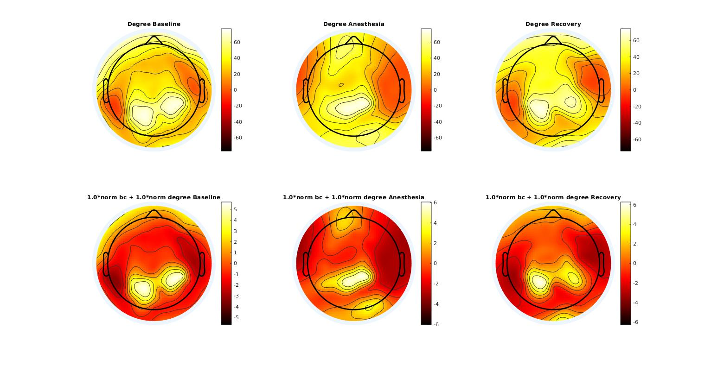
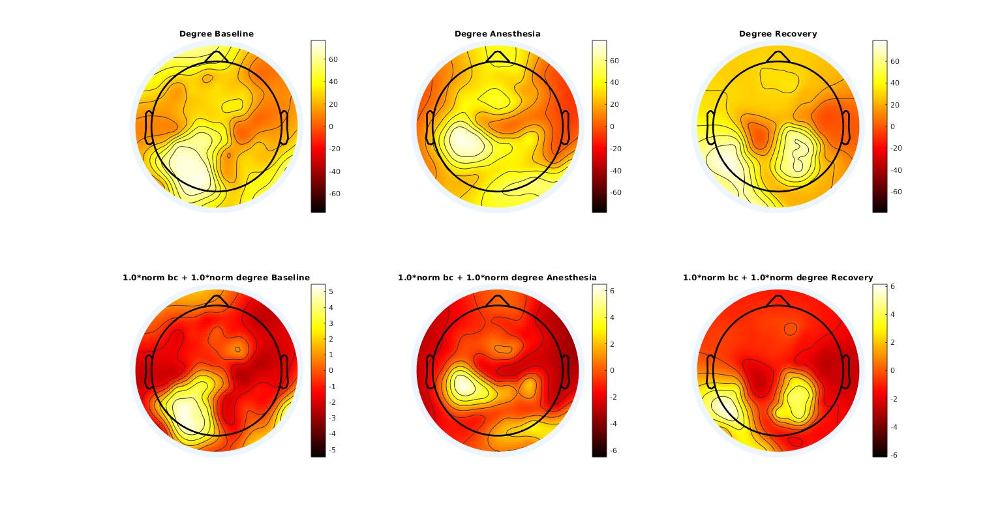
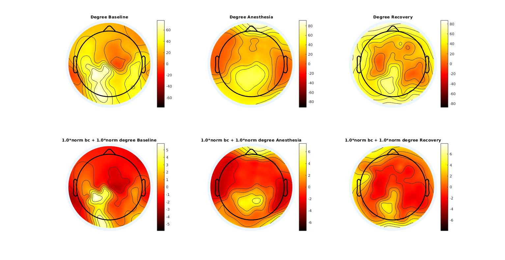

# Neuro Algorithm (NA)
This library is used by the BIAPT lab to simplify the analysis of the various computational neuroscience experiment we are running.

## Table of Content
- [Code Architecture](#code-architecture)
- [Features](#features)
    - [Hub Location](#hub-location)
- [References](#references)

## Code Architecture

## Features
NA comes bundled with a few features that can be used out of the box.

### Hub Location
A hub is a node in the brain with a lot of incoming connection, but a few outputing connection.
We can use the degree to approximate this, however using betweeness centrality help a lot the analysis. **The hub location has now two parameter to control how much of the degree and the betweeness centrality we want to take into consideration.**
Below you will see the hub location definition we've build using the [Brain Connectivity Toolbox](https://sites.google.com/site/bctnet/).

Concretely this is how we can use the `na_hub_location.m` functino:
```matlab

   recording = load_set('name_of_data.set',path_to_data);
   frequency_band = [7 13]; 
   window_size = 10; 
   number_surrogate = 10; 
   p_value = 0.05; 
   threshold = 0.10;
   step_size = 10;
   a_degree = 1.0;
   a_bc = 1.0;
   result_hl = na_hub_location(recording, frequency_band, window_size, step_size, number_surrogate, p_value, threshold, a_degree, a_bc);

```
For more detailed help type `help na_hub_location` at the MATLAB command prompt.

The definition of a hub we are using is the following:
`hub = Max of (a_bc*norm_betweenes_centrality + a_degree*norm_degree)`

This is given by the following code:
```matlab
function [hub_location] = betweeness_hub_location(b_wpli, location, a_degree, a_bc)
%BETWEENESS_HUB_LOCATION select a channel which is the highest hub based on
%betweeness centrality and degree
% b_wpli: binary matrix
% location: 3d channels location

    %% 1.Calculate the degree for each electrode.
    degrees = degrees_und(b_wpli);
    norm_degree = (degrees - mean(degrees)) / std(degrees);
    
    
    %% 2. Calculate the betweeness centrality for each electrode.
    bc = betweenness_bin(b_wpli);
    norm_bc = (bc - mean(bc)) / std(bc);
    
    
    %% 3. Combine the two metric (here we assume equal weight on both the degree and the betweeness centrality)
    weights = a_degree*norm_degree + a_bc*norm_bc;
        
    %% Obtain a metric for the channel that is most likely the hub epicenter
    [~, channel_index] = max(weights);
    hub_location = threshold_anterior_posterior(channel_index, location);
end
```

Here are example of the topographic maps obtained by this method as compared to only using the degree across state of consciousness
#### MDFA03 (Healthy)


#### MDFA05 (Healthy)


#### MDFA06 (Healthy)


#### MDFA07 (Healthy)



## References
- [Brain Connectivity Toolbox](https://sites.google.com/site/bctnet/)) : This is a library written in MATLAB which is used to do graph theory on brain signals. We use it to build much of our graph theory related analysis.